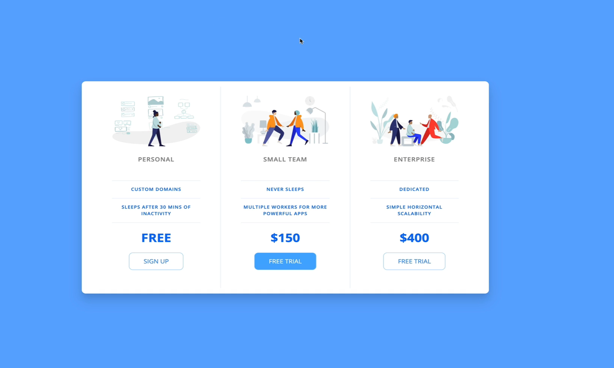

# Pricing Panel Project
The goal of this project is to create a responsive pricing panel using CSS. The panel will display different pricing options for a product or service, allowing users to easily compare features and prices.

## Desired Outcome

## Features
- Responsive design that works on both desktop and mobile devices.✅
- Three pricing options: Personal, Small Team, and Enterprise.✅
- Each pricing option includes a list of features and a call-to-action button.✅
